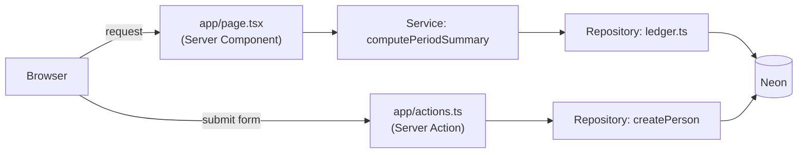

![[Pasted image 20260618142742.png]]

![[Pasted image 20260618144748.png]]

``` mermaid
flowchart LR
    B[Browser] -->|request| P["app/page.tsx<br/>(Server Component)"]
    P --> S[Service: computePeriodSummary]
    S --> R[Repository: ledger.ts]
    R --> DB[(Neon)]
    B -->|submit form| A["app/actions.ts<br/>(Server Action)"]
    A --> R2[Repository: createPerson] --> DB
```

